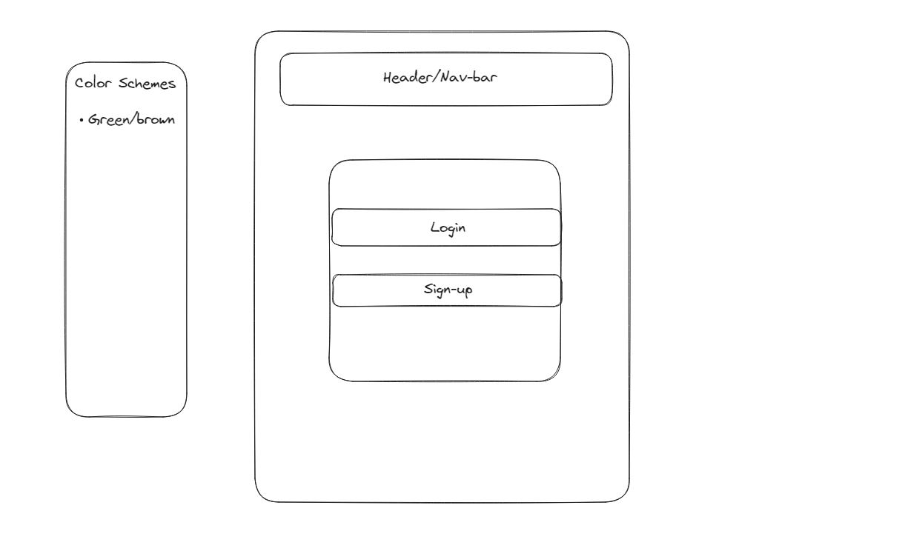

# Group project 2

## Team Members
- Johnaten Nguyen
- John Garrison
- Beth Haynes (https://github.com/beffylaureen)
- Peter Lauer

## APIS
- Nutrition https://platform.fatsecret.com/api/
hi

## MVP IDEA
- Nutrition Tracker
- Form = Login/Sign Up,
- Database = MySQL,  Nutrition Counter, Protein,
- Front-End = Bootstrap, JQuery, 
- Back-End = HandleBars, Sequelize, 

## Additional Ideas

- Barcode/UPC scanner to make website more mobile resposive

## Git Guide
- Git branch "BRANCH_NAME"

- Git checkout "BRANCH_NAME"

- Git add -A

- Git commit -m "__"

- Git push origin "BRANCH_NAME" 

- Do a pull request

## Back-end development 

- Data Base design
  - what data are we storing?
  - MySQL
  - Data handling

- Install necessary tools
  - Dependencies

- API End-Points

- Authenticator

- Middleware 
  - input validation

## Day 1 TODO
- [X] Plan the project 
- [X] Figure out the MVP 
- [X] Make Repo and get everyone familar with git 
- [X] Find API 

## Day 2 TODO 
- Make boiler plate express and sequelize files 
- Back-end John, Peter
- Front-end Johnaten/Home Page, Beth/Login-Signup page

## Day 2 Landing page skeleton

## Day 4 TODO
- Make sure the bottons are working 
- Organize Stucture of files 
- Authorization
-
